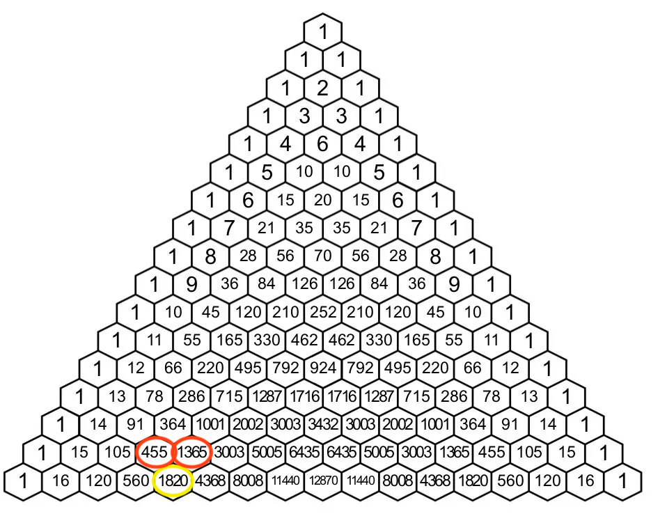

### Inleiding

Je hebt in de lagere cyclus de driehoek van Pascal leren kennen - hoop ik. Maak je geen zorgen als dat niet het geval zou zijn, want het is echt geen probleem als je nog nooit van deze driehoek gehoord hebt. Later dit jaar ga je er bij wiskunde nog veel meer over leren, maar ik probeer in deze opgave bewust zo weinig mogelijk wiskunde te betrekken.

De driehoek van Pascal is opgebouwd volgens een vast patroon: 
* het getal in de top van de driehoek is gelijk aan 1;
* op de twee schuine zijden staat telkens een 1;
* elk getal in de driehoek is gelijk is aan de som van de twee getallen links- en rechtsboven dit getal.

Onderstaande figuur maakt dit duidelijk: zo is het getal 1820 op de onderste rij bijvoorbeeld gelijk aan 455 + 1365.

{:width="80%"}

In feite is de driehoek van Pascal dus een grafische weergave van getallen die op een recursieve manier gedefinieerd zijn. Een getal op de $$n$$-de rij is immers gelijk aan de som van twee getallen op de $$(n-1)$$-ste rij.

Laten we een aantal zaken definiëren:
* de variabele $$n$$ geeft weer op de hoeveelste rij van de driehoek een getal zich bevindt, waarbij de bovenste rij (de top) van de driehoek overeenkomt met $$n=0$$;
* de variabele $$k$$ geeft het rangnummer aan van een getal binnen een rij, waarbij het eerste element links op elke rij overeenkomt met $$k=0$$;
* we noteren het getal op rij $$n$$ met rangnummer $$k$$ als `Pascal(n, k)`.

Het getal 1820 noteren we dus als `Pascal(16, 4)`. Dit getal is de som van `Pascal(15, 3)` en `Pascal(15, 4)`. *Ga voor jezelf na dat je dit goed begrijpt.* 

We kunnen deze eigenschap veralgemenen:
* `Pascal(n, k)` = `Pascal(n-1, k-1)` + `Pascal(n-1, k)` (voor $$k \leq n$$)
* `Pascal(n, n)` = 1
* `Pascal(n, 0)` = 1

### Opgave

1. Schrijf een functie `Pascal_recursief(n, k)` die op een *recursieve* manier de waarde berekent van het getal op rij $$n$$ en met rangnummer $$k$$ in de driehoek van Pascal.
2. Schrijf een functie `som_Pascal(n)` die op een *iteratieve* manier de som berekent van alle getallen op rij $$n$$ in de driehoek van Pascal. *Uiteraard steun je in deze definitie zo veel mogelijk op de functies die je in 1 al gedefinieerd hebt.*

*Als je vraag 1 niet gevonden hebt, kan je geen werkende code schrijven voor vraag 2. Dat neemt niet weg dat je in vraag 2 wel degelijk kan doen alsof `Pascal_recursief(n, k)` correct gedefinieerd is. Je kan dus al je punten halen op vraag 2 terwijl je niets ingevuld hebt bij vraag 1.*

Zoals steeds in dit soort opgaves mag er in de code die je door Dodona laat evalueren *geen hoofdprogramma* staan. Je code bestaat dus uit twee functiedefinities, en niet meer dan dat. Een eventueel hoofdprogramma dat je gebruikt hebt om je code te testen, moet je bij de evaluatie dus in commentaar zetten, of zelfs gewoon verwijderen.
 
### Voorbeeld 1

**Invoer:**

    >>> Pascal_recursief(4, 2)

**Uitvoer:**

    6

### Voorbeeld 2

**Invoer:**

    >>> Pascal_recursief(16, 4)

**Uitvoer:**

    1820

### Voorbeeld 3

**Invoer:**

    >>> som_Pascal(0)

**Uitvoer:**

    0

### Voorbeeld 4

**Invoer:**

    >>> som_Pascal(4)

**Uitvoer:**

    16