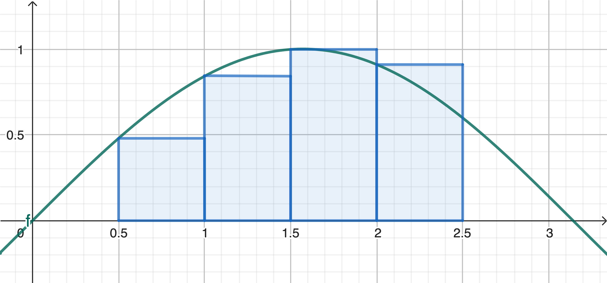
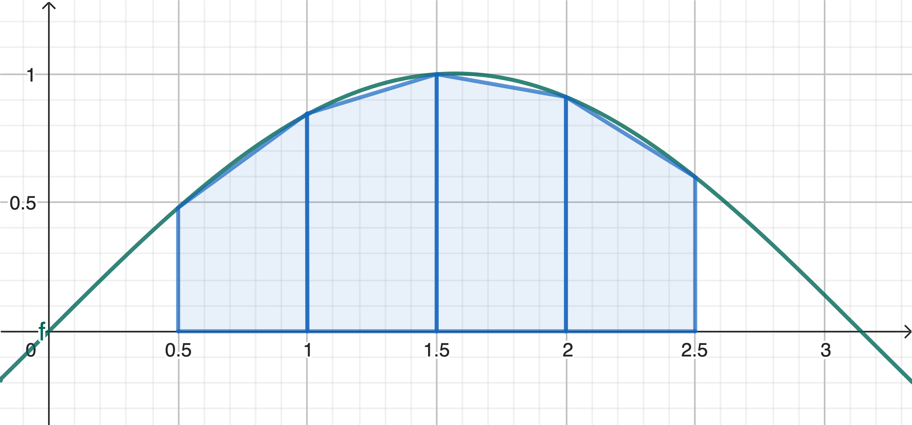

### Inleiding

Je hebt bij wiskunde geleerd dat je een bepaalde integraal kunt beschouwen als de som van een oneindig aantal termen.  De precieze details van deze riemannsom zijn in deze opgave niet van belang. Belangrijker is te beseffen dat deze methode grafisch neerkomt op het optellen van de oppervlakte van een groot aantal rechthoekjes. Onderstaande figuur geeft een mogelijke manier om een riemannsom te berekenen.

{:width="80%"}

In feite benaderen we $$f(x)$$ in elk deelinterval door een functie van de nulde graad (een constante functie). Dit is een vrij grove benadering, die weliswaar nadert naar de correcte georiënteerde oppervlakte naarmate het aantal deelintervalletjes toeneemt.

We gaan in deze opgave een kleine verfijning doorvoeren aan de riemannsom die je kent. Net zoals bij een riemannsom verdeel je ook hier het interval $$[a, b]$$ in $$n$$ gelijke deelintervalletjes met breedte $$\Delta x$$. In plaats van de georiënteerde oppervlakte te beschouwen als de som van rechthoekjes, berekenen we nu echter de som van de oppervlaktes van een groot aantal trapeziums. Zo benaderen we $$f(x)$$ in elk deelinterval door een functie van de eerste graad. Onderstaande figuur illustreert dat deze *trapeziumregel* voor een zelfde aantal deelintervalletjes in het algemeen een betere benadering geeft dan de riemannsom die je kent.

{:width="80%"}

In de lagere school heb je hopelijk geleerd dat je de oppervlakte van een trapezium met grote basis $$B$$, kleine basis $$b$$ en hoogte $$h$$ kunt berekenen als $$\displaystyle \frac{B+b}{2} \cdot h$$. Als we het $$i$$-de deelinterval definiëren als $$[x_i, x_{i+1}]$$, vind je de oppervlakte van de $$i$$-de deeltrapezium dus als $$\displaystyle \frac{f(x_i) + f(x_{i+1})}{2} \cdot \Delta x$$. De totale oppervlakte van alle deeltrapeziums wordt dan ook gegeven door $$\displaystyle \sum _{i=1}^{n} \frac{f(x_{i}) + f(x_{i+1})}{2} \cdot \Delta x \,$$.

### Opgave

1. Schrijf een functie `Delta_x(a, b, n)` die de breedte $$\Delta x$$ van elk deelinterval berekent wanneer je $$[a,b]$$ verdeelt in $$n$$ gelijke deelintervallen.
2. We maken in deze opgave gebruik van $$f(x) = \cos x$$. Schrijf een functie `f(x)` die de waarde van $$\cos(x)$$ teruggeeft.
3. Schrijf een functie `x_i(a, i, Delta_x)` die de ondergrens van het $$i$$-de deelinterval $$[x_i, x_{i+1}]$$ teruggeeft. Denk ook na hoe je de bovengrens van het $$i$$-de deelinterval $$[x_i, x_{i+1}]$$ kunt berekenen. Je mag daarvoor natuurlijk een functie schrijven, maar dat hoeft niet.
4. Schrijf een functie `trapeziumregel(a, b, n)` die de waarde van $$\displaystyle \sum _{i=1}^{n} \frac{f(x_{i}) + f(x_{i+1})}{2} \cdot \Delta x \,$$ teruggeeft, waarbij $$\Delta x$$ en $$x_i$$ berekend worden zoals hierboven beschreven. *Uiteraard steun je in deze definitie zo veel mogelijk op de functies die je in 1, 2 en 3 al gedefinieerd hebt.*

Zoals steeds in dit soort opgaves mag er in de code die je door Dodona laat evalueren *geen hoofdprogramma* staan. Je code bestaat dus uit vier functiedefinities, en niet meer dan dat. Een eventueel hoofdprogramma dat je gebruikt hebt om je code te testen, moet je bij de evaluatie dus in commentaar zetten, of zelfs gewoon verwijderen.
 
### Voorbeeld 1

**Invoer:**

    >>> Delta_x(0, 1, 1000)

**Uitvoer:**

    0.001

### Voorbeeld 2

**Invoer:**

    >>> f(1.0471975511965976)

**Uitvoer:**

    0.5000000000000001

### Voorbeeld 3

**Invoer:**

    >>> x_i(0, 50, 0.001)

**Uitvoer:**

    0.05

### Voorbeeld 4

**Invoer:**

    >>> trapeziumregel(0, 1.5707963267948966, 100)

**Uitvoer:**

    0.9999794382396078